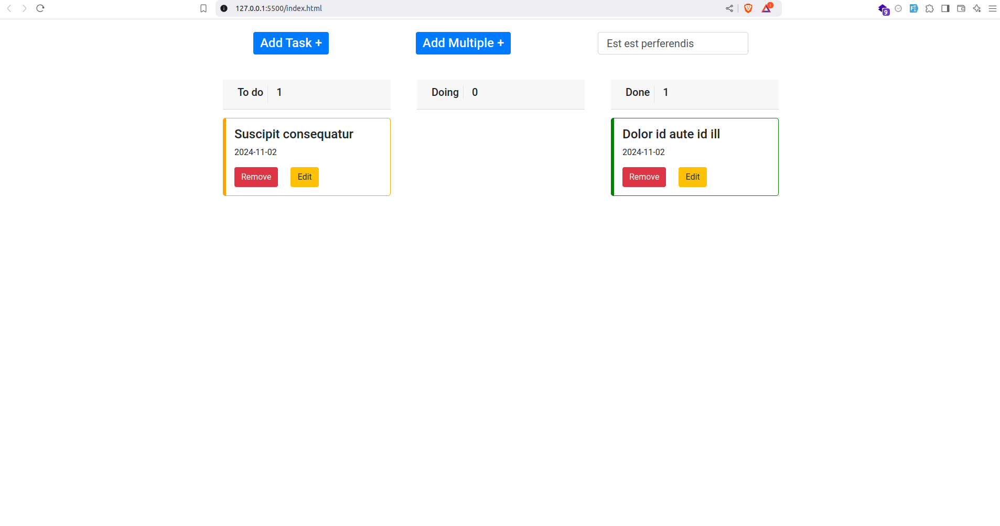

# Brief-4-JS-TODOlist

## Description
Une application TODO list simple utilisant JavaScript natif. Permet aux utilisateurs d'ajouter, de supprimer et de marquer des tâches comme complètes.

## Context de project
 * Page d'accueil : Création d'une interface moderne avec HTML et Tailwind CSS.
 * Modal d'ajout : Champs pour titre, description, statut (To do, doing, done), date d’échéance, et priorité (P1, P2, P3) avec affichage coloré.
 * Liste organisée : Affichage des tâches  avec titre, date d’échéance et priorité.
 Changement de statut : Permet aux utilisateurs de modifier le statut des tâches.
 * Statistiques : Affichage du nombre total de tâches.
 * Suppression : Fonctionnalité pour supprimer des tâches.
 * Validation des formulaires : Garantir la qualité des données saisies.
 * Dynamisme : Utilisation de JavaScript pour des animations d'ajout et de suppression.
 * Déploiement : Projet accessible en ligne via GitHub Pages ou Vercel.

## Les Outils Utilisées
* HTML
* CSS
* Javascript

## Fonctionnalite

* Ajouter une tache.
* Afficher les Détails d'une tache.
* Editer la status d'une tache.
* Supprimer une tache.